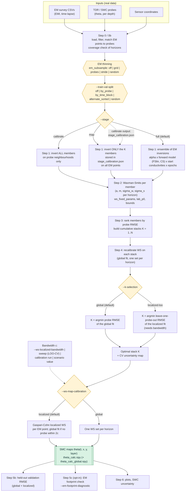

# Real data to SMC (soil moisture content) maps

Yellow = option points (CLI flag), green = result. Paste the block into any Mermaid renderer (GitHub, VS Code, mermaid.live).

```mermaid
flowchart TD
    %% ---------- inputs ----------
    subgraph IN["Inputs (real data)"]
        EM["EM survey CSVs<br/>(EMI, time-lapse)"]
        TDR["TDR / SWC probes<br/>(theta, per depth)"]
        XY["Sensor coordinates"]
    end

    EM & TDR & XY --> S0["Step 0 / 0b<br/>load, filter, match EM points to probes<br/>coverage check of horizons"]

    S0 --> O_SUB{{"EM thinning<br/>em_subsample: off | grid | probes | stride | random"}}
    O_SUB --> O_SPLIT{{"--train-val-split<br/>off | by_probe | by_time_block |<br/>alternate_sorted | random"}}
    O_SPLIT --> O_STAGE{"--stage"}

    %% ---------- stage options ----------
    O_STAGE -- "full (default)" --> S1
    O_STAGE -- "calibrate" --> S1c["Step 1: invert ALL members<br/>on probe neighbourhoods only"]
    O_STAGE -- "map" --> S1m["Step 1: invert ONLY the K members<br/>stored in stage_calibration.json<br/>on all EM points"]

    %% ---------- ensemble ----------
    S1["Step 1: ensemble of EM inversions<br/>alpha x forward model (FSlin, CS) x start conductivities x epochs"]
    S1c --> S2
    S1m --> S2
    S1 --> S2

    S2["Step 2: Waxman-Smits per member<br/>(a, m, sigma_w, sigma_s per horizon)<br/>ws_fixed_params, lab_p0, bounds"]
    S2 --> S3["Step 3: rank members by probe RMSE<br/>build cumulative stacks K = 1..N"]
    S3 --> S4["Step 4: recalibrate WS on each stack<br/>(global fit, one set per horizon)"]

    %% ---------- K selection ----------
    S4 --> O_K{"--k-selection"}
    O_K -- "global (default)" --> K1["K = argmin probe RMSE<br/>of the global fit"]
    O_K -- "localized-loo" --> K2["K = argmin leave-one-probe-out RMSE<br/>of the localized fit<br/>(needs bandwidth)"]
    K1 --> K["Optimal stack K<br/>+ CV uncertainty map"]
    K2 --> K

    %% ---------- bandwidth + mapping ----------
    BW["Bandwidth c:<br/>--ws-localized-bandwidth | sweep (LOO-CV) |<br/>calibration run | scenario value"] -.-> O_MAP
    K --> O_MAP{"--ws-map-calibration"}
    O_MAP -- "localized (default)" --> M1["Gaspari-Cohn localized WS<br/>per EM point; global fit if no probe within 2c"]
    O_MAP -- "global" --> M2["One WS set per horizon"]
    M1 --> SMC
    M2 --> SMC

    SMC[["SMC maps theta(t, x, y, layer)<br/>theta_calc.npy (+ theta_calc_global.npy)"]]

    %% ---------- checks ----------
    SMC --> V5b["Step 5b: held-out validation RMSE<br/>(global + localized)"]
    SMC --> V5c["Step 5c (opt-in): EM footprint check<br/>--em-footprint-diagnostic"]
    SMC --> V6["Step 6: plots, SWC uncertainty"]
    O_STAGE -. "calibrate output:<br/>stage_calibration.json" .-> S1m

    classDef opt fill:#fff4d6,stroke:#c79100,color:#333;
    classDef out fill:#d9f2e3,stroke:#2e8b57,color:#133;
    class O_SUB,O_SPLIT,O_STAGE,O_K,O_MAP opt;
    class SMC out;
```
